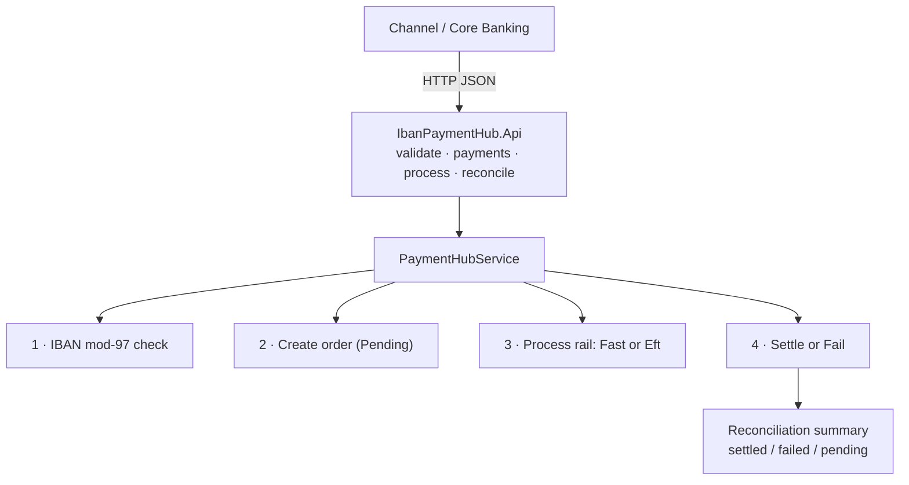
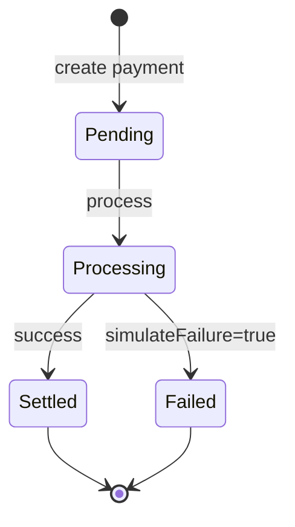

# IBAN Payment Hub

Payment initiation hub with IBAN validation, FAST/EFT rail selection, settlement simulation, and reconciliation.

Built with **.NET 10**. Useful as a portfolio demo of payment orchestration patterns used in retail banking integrations.

## Architecture



Payment lifecycle:



## Features

- IBAN normalization + ISO 13616 mod-97 validation
- Create payment orders (`Fast` / `Eft`)
- Process / settle payments (optional explicit `simulateFailure` for demos)
- List payments and produce a reconciliation summary
- OpenAPI document included

## Quick start

```bash
dotnet restore
dotnet test
dotnet run --project IbanPaymentHub.Api
```

API base URL (HTTP): `http://localhost:5059`

## Example flow

```bash
# Validate IBAN
curl -s -X POST http://localhost:5059/api/iban/validate \
  -H "Content-Type: application/json" \
  -d "{\"iban\":\"DE89 3704 0044 0532 0130 00\"}"

# Create payment
curl -s -X POST http://localhost:5059/api/payments \
  -H "Content-Type: application/json" \
  -d "{
    \"debtorIban\":\"DE89370400440532013000\",
    \"creditorIban\":\"GB82WEST12345698765432\",
    \"amount\":250.00,
    \"currency\":\"TRY\",
    \"rail\":\"Fast\",
    \"reference\":\"INV-42\"
  }"

# Process + reconcile
curl -s -X POST http://localhost:5059/api/payments/PAY-XXXXXXXX/process
curl -s http://localhost:5059/api/reconciliation
```

Tip: set `"simulateFailure": true` on create to exercise the failed settlement path in demos/tests.

## API

| Method | Path | Description |
|--------|------|-------------|
| `POST` | `/api/iban/validate` | Validate IBAN |
| `POST` | `/api/payments` | Create payment |
| `POST` | `/api/payments/{id}/process` | Process/settle |
| `GET` | `/api/payments/{id}` | Get payment |
| `GET` | `/api/payments` | List payments |
| `GET` | `/api/reconciliation` | Settlement summary |
| `GET` | `/health` | Health check |

## Design notes

- Validation uses rearranging country/check digits and mod-97
- FAST demo hard-limit is 100,000 (illustrative)
- Storage is in-memory for zero-infrastructure demos

## Tests

```bash
dotnet test
```

## License

MIT — see [LICENSE](LICENSE).
